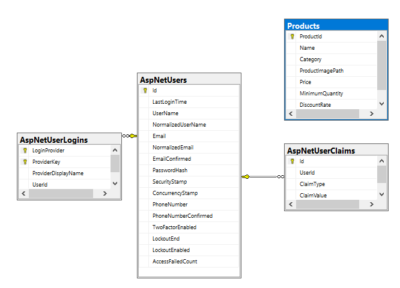

# Online store REST api 🏧

This project is a online store rest api to support ecommerce website backend

-   I created a REST api with access to database (ef core), JWT security (Identity), Logging (Serilog)
-   Testing (Nunit, Moq, sqlite in memory) methodology
    -   Tested products service ensuring correct logic and exception handling
    -   Tested user controller endpoints for correct routes response
    -   Todo: Test products controller for correct endpoints routes responses

## Technologies

<a href="https://skillicons.dev">

</a>
Additional used

-   Nunit
-   Serilog
-   Entity framework
-   Sql server
-   Identity

### Database schema

For better quality check the file ["Schema.jpg"](Schema.png)


## Getting Started [🔼](#table-of-contents)

### Prerequisites [🔼](#table-of-contents)

    -   Git
    -   DotNet 8
    -   SqlServer

### Installation [🔼](#table-of-contents)

Steps to install and run this project locally

-   Step 1 clone project in terminal paste:
    ```bash
    git clone github.com/ahmads1990/VendingMachineApi
    ```
-   Step 2
    -   Using(sqlite sqlite branch) for faster startup you can clone and run this project (with local sqlite db file) without having to download sql server
